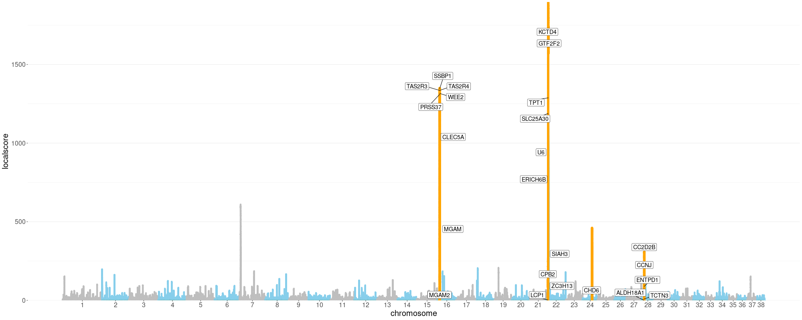

# Pval2Gene
From a genome-wide p-value(or any other score) to clear manhattan plot with gene annotated.

## Introduction
The pipeline is originally built for the post analysis of the output result from GRoSS (Graph-aware Retrieval of Selective Sweeps, https://github.com/FerRacimo/GRoSS), which is described in the following paper: https://genome.cshlp.org/content/29/9/1506. However, the pipeline is also capable of managing the general genome-wide p-value dataset with 3 columns (CHR POS P-value/Score).
The GRoSS output includes the chi-squared statistics and the corresponding p-values for each branch of the admixture graph. This pipeline is applied for highlighting and gene annotation of significant candidate regions in a specific chosen branch.

For pinpointing the significant regions, this pipeline contains a P-value refinement process (local score process) which is introduced and realized from Fariello et.al 2017. https://onlinelibrary.wiley.com/doi/full/10.1111/mec.14141 Please cite this paper if you end up using this pipeline.
After the local score process, genes are aligned to the significant regions (with 50kb extension on both sides) and annotated. The gene regions with a distance shorter than 500kb are merged into tracts to be highlighted.

Updates for general application still on the way, which includes:
Genome-wide gene alignment and annotation for genes in top quantiles \\
Options for applying local score approach or not \\
Tolerance for user-defined chromosome choice \\
## Preparation of Packages
R packages:
ggplot2
data.table
RColorBrewer
tidyverse
qqman
## Usage
## Examples
Example of the result plot.

